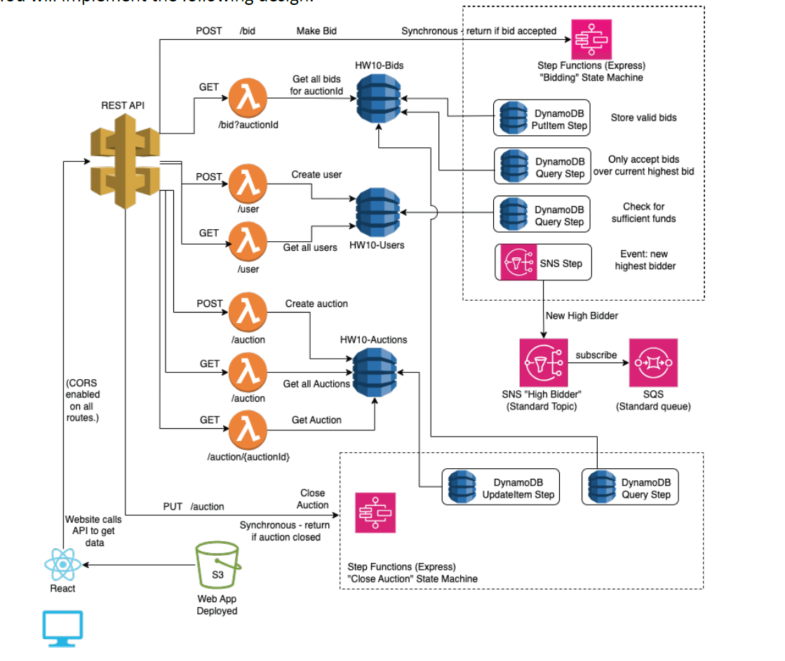
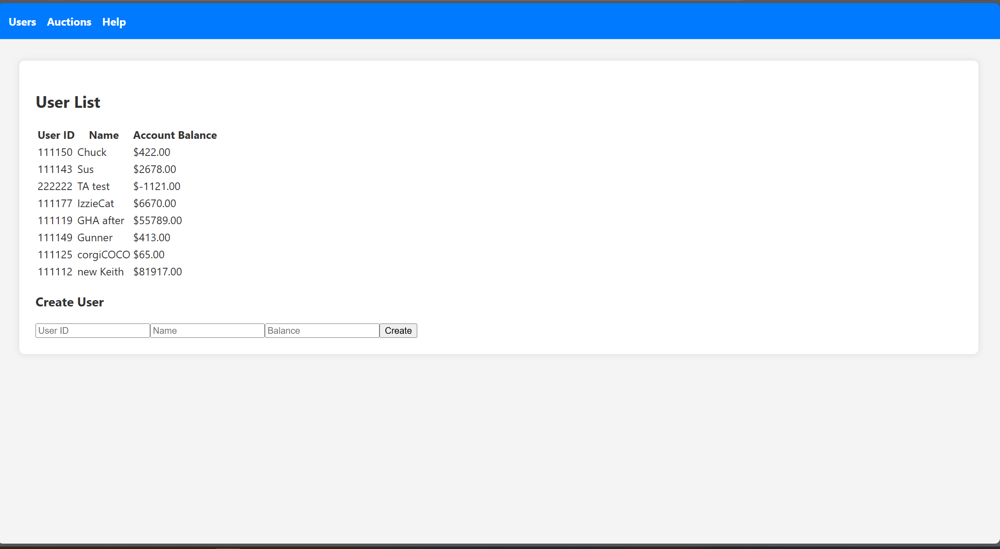
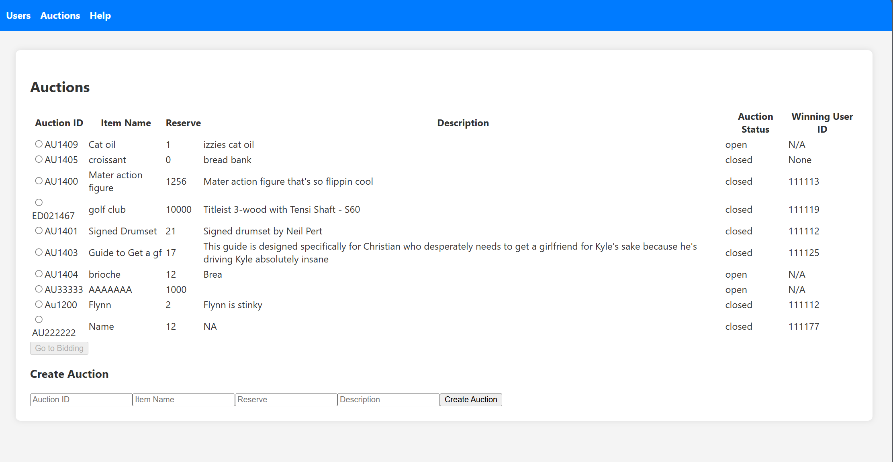
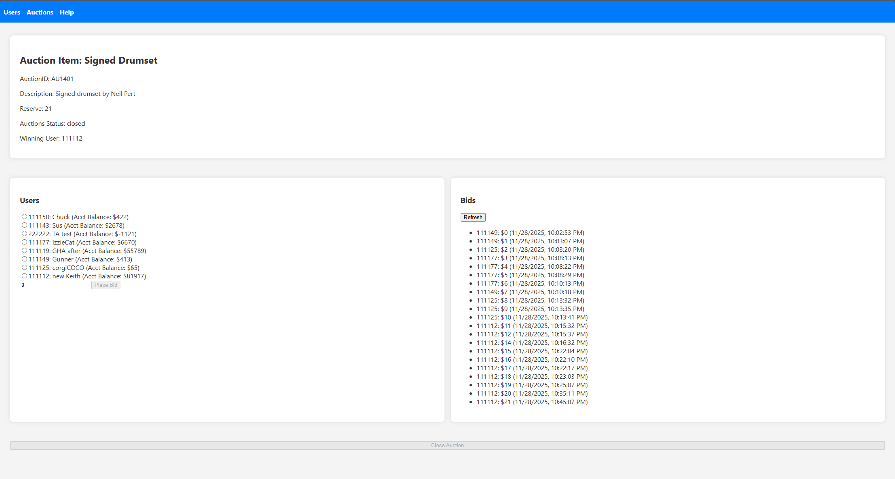

# Hello :)

### Website (no longer works)
* `http://website-us-east-1.amazonaws.com/`  

This project was about deploying a simple Auction app to s3, then using multiple routes in API gateway for Auctions, Bids, & Users. 

The users were created with Unique IDs, names, & balances. They were stored in a DynamoDB table. 

Auctions were items that had unique IDs, reserves, statuses, names, & descriptions. 

Bids were a combination of user information as well as the auction's current statuses. 

We implemented this design:

The User page is seen below. Users could create a new account:  

The Auction page acted similar to the Users. Both including Lambda functions:

The Bidding page input the current status of the auction as well as the highest bidders. It is possible to close an auction with no bids:

